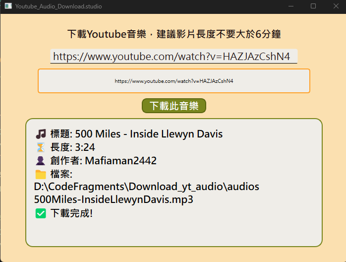
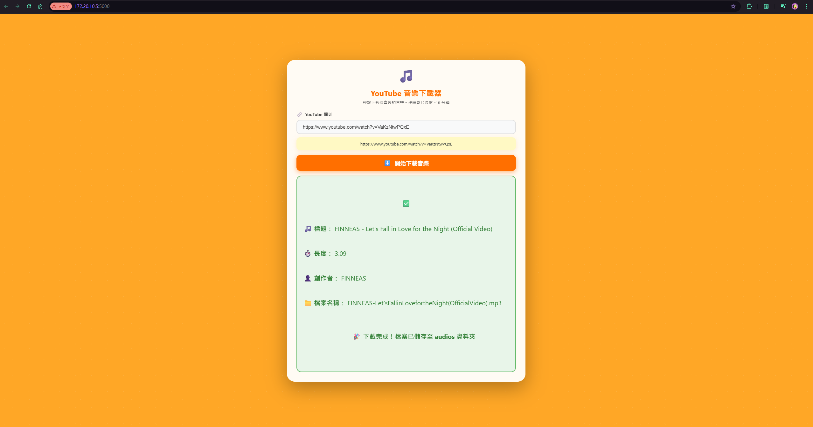

# YouTube Audio Downloader

### Purpose
This project provides CLI, GUI, and Web-based tools to download audio from YouTube videos and save them as MP3 files. Perfect for extracting music, podcasts, or any audio content from YouTube.

### Project Structure
```
Download_yt_audio/
├── README.md                    # Project documentation
├── Dockerfile                   # Docker configuration for Flask web app
├── requirements.txt             # Python dependencies
├── .dockerignore                # Docker ignore file
├── audios/                      # Downloaded audio files (MP3)
├── docs/                        # Documentation images
│   └── gui_screenshot.png
└── src/                         # Source code
    ├── yt_download_audio.py     # CLI version
    ├── yt_download_gui.py       # Desktop GUI version (PyQt6)
    ├── yt_download_flask.py     # Web version (Flask)
    └── templates/
        ├── index.html           # Flask web interface (simple)
        └── index_modern.html    # Flask web interface (modern design)
```

### Output Location
All downloaded audio files are saved to: `Download_yt_audio/audios/`
- Files are automatically named using the video title (spaces removed)
- Custom filenames can be specified in the CLI version using the `-p` parameter
- All files are saved in MP3 format

---

## Setup

### Prerequisites
* Python 3.x with conda
* Required conda environment: `g_project_env3_deploy_model`

### Activate Environment
```bash
# Activate environment
conda activate g_project_env3_deploy_model

# Deactivate when done
conda deactivate 
```

---

## Usage

### CLI Version
Navigate to the `src/` folder and run:

```bash
# Show help message
python yt_download_audio.py -h

# Download with auto-generated filename (based on video title)
python yt_download_audio.py -u https://www.youtube.com/watch?v=VIDEO_ID

# Download with custom filename
python yt_download_audio.py -u https://www.youtube.com/watch?v=VIDEO_ID -p my_audio.mp3
python yt_download_audio.py -u https://www.youtube.com/watch?v=VIDEO_ID -p my_audio
```

**Note:** `.mp3` extension is added automatically if not specified.

### GUI Version (Desktop)
Navigate to the `src/` folder and run:

```bash
python yt_download_gui.py
```

**Steps:**
1. Paste the YouTube URL in the input field
2. Click the `下載此音樂` (Download) button
3. View download progress and video information
4. File is saved to the `audios/` folder when complete

**GUI Window:**



---

### Web Version (Flask) - **Recommended for Docker**
Navigate to the `src/` folder and run:

```bash
python yt_download_flask.py
```

**Access the web interface:**
1. Open your browser and go to `http://localhost:5000`
2. Paste the YouTube URL in the input field
3. Click the `開始下載音樂` (Download) button
4. View download progress and video information
5. Files are saved to the `audios/` folder

**Features:**
- Modern, responsive web interface with animations
- Real-time download progress indicator
- Color-coded status messages (loading/success/error)
- Works on all platforms (Windows, Mac, Linux)
- Perfect for Docker deployment

**Web Interface:**



**Stop the server:** Press `Ctrl+C` in the terminal

---

### Docker Usage (Flask Web Version)
Docker runs the **Flask web application** by default, which works perfectly on all platforms.

#### 1. **Build the Docker image**
```bash
cd Download_yt_audio
docker build -t yt_audio_download_app .
```
* `-t`: Give the image a name
* `.`: Tells Docker to look for the Dockerfile in the current directory

#### 2. **Run the Flask web server**

**With volume mount to persist files (recommended):**
```bash
# Git Bash
docker run --rm -p 5000:5000 -v /d/CodeFragments/Download_yt_audio/audios:/app/audios yt_audio_download_app

# PowerShell
docker run --rm -p 5000:5000 -v D:/CodeFragments/Download_yt_audio/audios:/app/audios yt_audio_download_app
```

**Then open your browser:** `http://localhost:5000`

**Options explained:**
* `--rm`: Automatically remove the container when it exits
* `-p 5000:5000`: Map port 5000 from container to host (access via localhost:5000)
* `-v host_path:container_path`: Mount host folder to persist downloaded files

**Stop the server:** Press `Ctrl+C` in the terminal

#### 3. **Alternative: Run CLI version in Docker**
```bash
# Interactive bash terminal
docker run --rm -it -v D:/CodeFragments/Download_yt_audio/audios:/app/audios yt_audio_download_app bash

# Direct download with CLI and exit
docker run --rm -v D:/CodeFragments/Download_yt_audio/audios:/app/audios yt_audio_download_app python src/yt_download_audio.py -u https://www.youtube.com/watch?v=VIDEO_ID
```

#### 4. **Run container for reuse** (container persists after exit) (**without `--rm`**)
```bash
# Create and run the container (first time)
docker run -it -p 5000:5000 -v D:/CodeFragments/Download_yt_audio/audios:/app/audios --name my-yt-download-app yt_audio_download_app bash

# Restart and attach to an existing stopped container
docker start -ai my-yt-download-app

# Stop the container or Ctrl + c
docker stop my-yt-download-app

# Execute commands in a running container
docker exec -it my-yt-download-app bash
```